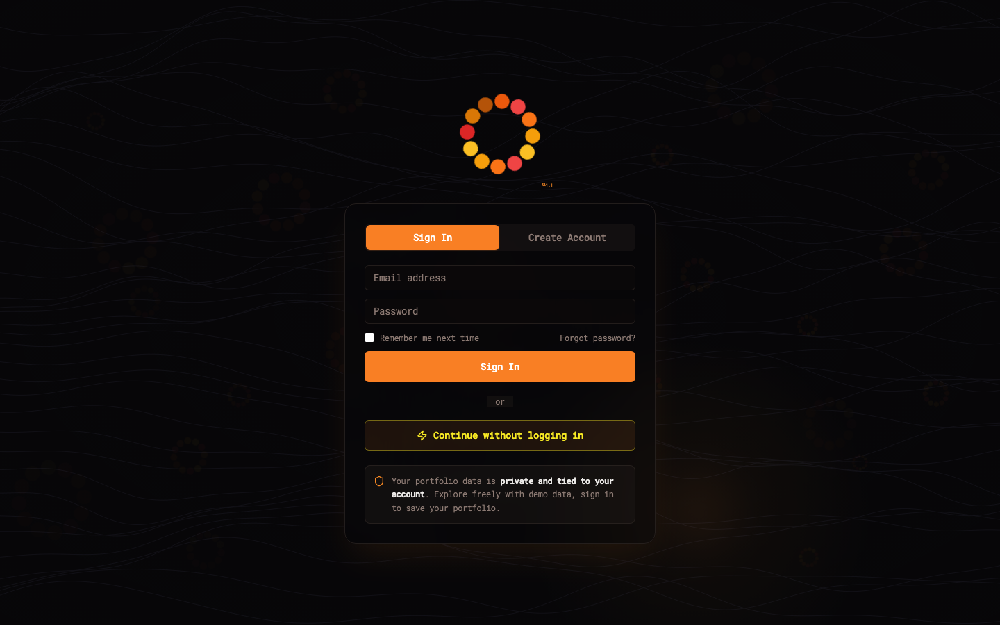
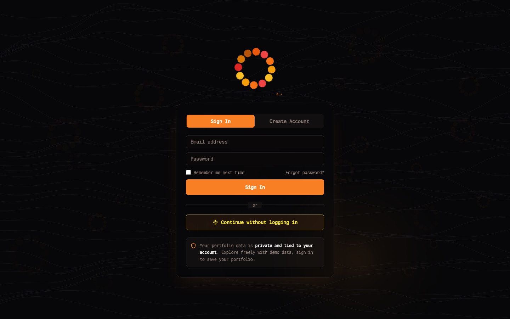

# Page Map — Visual Reference

Auto-captured from `https://unifolio.ca` in demo mode. Re-run with `npm run screenshot`.

| Route | Page | Screenshot |
|-------|------|------------|
| `/` | Dashboard |  |
| `/holdings` | Holdings |  |
| `/accounts` | Accounts |  |
| `/performance` | Performance |  |
| `/transactions` | Transactions |  |
| `/insights` | Insights (ETF X-Ray) |  |
| `/import` | Import Center |  |
| `/tax` | Tax Report |  |
| `/learn` | Learn |  |
| `/plans` | Plans & Pricing |  |
| `/community` | Community |  |
| `/instructions` | Import Instructions |  |
| `/privacy` | Privacy & Data |  |
| `/settings` | Settings |  |
| `/profile` | Profile |  |

## How to use

Reference pages by route + section name as defined in [docs/PAGES.md](../PAGES.md). Click any image to view full size.